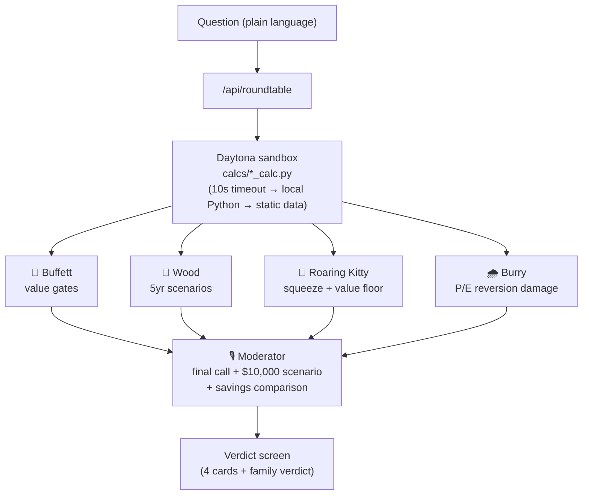

# 🏛️ The Round Table

**Four legendary investors debate your money question, then explain the verdict like a kind neighbor. Built for people who know nothing about finance.**

## The Story

I work in finance, and my parents still ask me "so… what should I buy?" What they actually need isn't a stock tip — it's the experience of watching the best investors in the world think about their question, in words a 70-year-old can fully understand. The Round Table gives them that: four investing philosophies argue it out, and a moderator translates the verdict into plain English, real dollar amounts, and one honest comparison with a savings account.

## How It Works

Ask anything — *"Tesla keeps dropping — is it okay to buy now?"* — and:

1. **Real math first.** Each persona's own Python script runs in a **Daytona sandbox** (P/E premium vs history, 5-year scenario multiples, squeeze/value-floor score, crash-scenario dollar damage).
2. **Four verdicts.** Fireworks AI renders four personas — styled after **Warren Buffett, Cathie Wood, Roaring Kitty, and Michael Burry** — each forced to end with `YES`, `NO`, or `YES_SMALL` plus a confidence score. No hedging allowed.
3. **The family verdict.** A Moderator counts the votes and produces the final screen: one big plain-English call, the scoreboard, a **$10,000 worst/best scenario**, the guaranteed savings-account alternative (~4%), when to ask again, and a safety note.



All prompts live in **`persona_prompts.md`** — the file is parsed at runtime, so editing it changes the app. Demo market data lives in `tsla_demo_data.json` (TSLA, updated through the 2026-07-24 close).

## Sponsor Tools

| Tool | What we use it for |
|---|---|
| **Fireworks AI** | All model inference. Round Table personas + Moderator run on `glm-5p2` (chosen over `kimi-k2p6` / `gpt-oss-120b` after a JSON-compliance & latency shootout). The CopilotKit chat endpoint (`/api/copilotkit`) runs `kimi-k2p6`. |
| **Daytona** | Every persona's `[CALC_RESULTS]` is computed by a real Python run in a sandbox (`lib/calc.js` — one sandbox created and reused across requests, ~0.7s per run). Cards display the compute source live. |
| **Braintrust** | Tracing: one question = one trace tree (`roundtable → persona:* → calc + llm → moderator`) in project `round-table-agent`. Evals: 30-case suite (`eval/run_eval.mjs`, experiment `roundtable-v1-30cases-f3036486`) — JSON validity 30/30, money translation 30/30, safety gate 8/10, plus an LLM parent-comprehensibility judge. |
| **CopilotKit** | Chat UI + runtime used for the first milestone (plain-language Q&A); the runtime endpoint is still live at `/api/copilotkit`. The Round Table verdict screen is custom React on top of the same Fireworks backend. |

## Safety by Design

- **Automatic NO triggers** — regardless of persona philosophy, the verdict is forced to NO when a question involves: betting everything on one stock, borrowed money (loans/margin/leverage), retirement savings at risk, or paid stock-picking rooms / "guaranteed return" schemes.
- **No impersonation** — personas are educational characters based on each investor's *public* philosophy. First-person impersonation ("I am Warren Buffett") is forbidden in the prompts; third-person references ("As Buffett puts it…") are allowed. Real names appear only as UI labels.
- **Plain language is the product** — no untranslated jargon in any `*_plain` field (say "the price tag compared to what the company actually earns", not "P/E"); every percentage must become real dollars on a $10,000 baseline; one everyday analogy per answer; short sentences; never condescending.
- **Never "buy"** — the strongest positive allowed is "worth a closer look — only with money you can spare." The final decision is always returned to the family.
- **Verified by evals** — the 30-case Braintrust suite checks JSON schema compliance, the safety gate on 10 trap questions (retirement all-in, borrowed money, guaranteed 10%/month, leverage…), dollar-translation presence, and comprehensibility for a finance-novice reader.

## Getting Started

Prereqs: **Node 18.17+** (we develop on Node 24) and optionally **Python 3** (only needed for the local calc fallback when Daytona is off/unreachable).

```bash
git clone https://github.com/heesooyoon0621/round-table-agent.git
cd round-table-agent
npm install
```

Create a `.env` file in the project root (values from your own accounts):

```
FIREWORKS_API_KEY=   # required — all model calls
DAYTONA_API_KEY=     # optional — sandbox calc (falls back to local Python without it)
BRAINTRUST_API_KEY=  # optional — tracing (skipped silently without it)
```

Optional: `USE_DAYTONA=false` forces the local-Python calc path.

Run it:

```bash
npm run dev
```

Open **http://localhost:3000** and click one of the example questions. First page load compiles for ~30s; each verdict takes ~20-40s (four parallel model calls + moderator).

Run the eval suite (writes results to Braintrust and `eval/last_run_rows.json`).
**Costs real Fireworks credits** (~180 model calls), so it refuses to run without the flag:

```bash
node eval/run_eval.mjs --yes-spend-credits
```

### Repo map

```
app/page.jsx               # Round Table UI: 4 persona cards + family verdict
app/api/roundtable/        # persona + moderator endpoint (with Braintrust spans)
app/api/copilotkit/        # CopilotKit chat runtime (Fireworks kimi-k2p6)
lib/roundtable.js          # prompt parsing, Fireworks calls, defensive JSON parsing
lib/calc.js                # Daytona sandbox runner + fallback chain
lib/trace.js               # Braintrust tracing (one tree per question)
calcs/*_calc.py            # per-persona Python calculations
persona_prompts.md         # THE source of truth for all prompts
tsla_demo_data.json        # raw demo market data (TSLA)
braintrust_eval_questions.json  # 30 eval cases (EN + KO)
eval/run_eval.mjs          # Braintrust eval harness (S1/S2/S3/S5)
```

---

*Educational personas based on public investment philosophies. Not affiliated. Not financial advice.*
