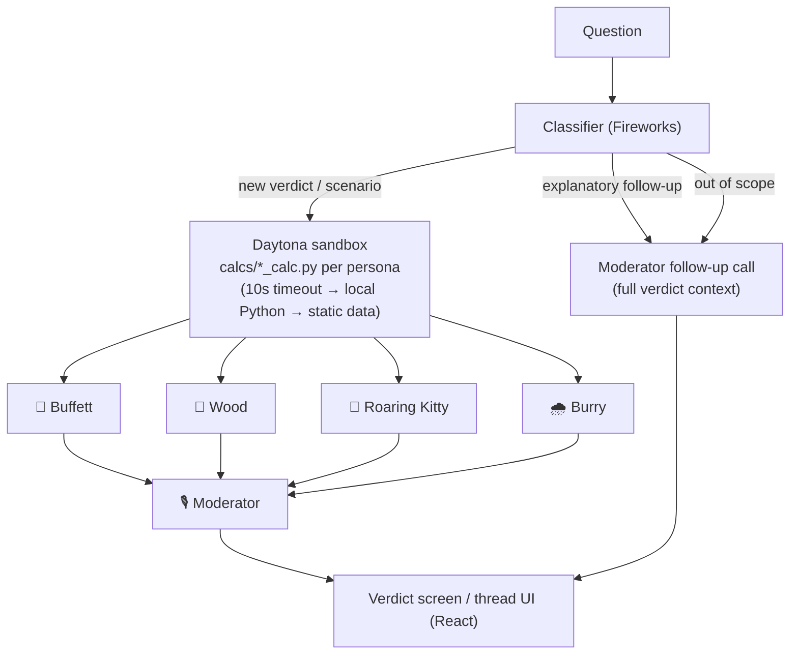

# 🏛️ The Round Table

**Four legendary investors debate your money question, then explain the verdict like a kind neighbor. Built for people who know nothing about finance.**

## The Story

I work in finance, and my parents still ask me "so… what should I buy?" What they actually need isn't a stock tip — it's the experience of watching the best investors in the world think about their question, in words a 70-year-old can fully understand. The Round Table gives them that: four investing philosophies argue it out, and a moderator translates the verdict into plain English, real dollar amounts, and one honest comparison with a savings account.

## What It Does

Four personas — **Warren Buffett, Cathie Wood, Roaring Kitty, and Michael Burry** (educational personas based on each investor's public philosophy) — each judge your question through their own framework and must land on `YES`, `NO`, or `YES_SMALL`. No hedging allowed.

Every verdict is grounded in **sandbox-computed math**: each persona's numbers come from its own Python script run on real market data, never from the model's imagination. Tickers outside the demo cache get an honest *"today's demo has live data for Tesla only"* — no fabricated numbers, ever.

The **Family Verdict** translates it all into plain English: one big call, a scoreboard, what happens to $10,000 in the worst and best case, the guaranteed savings-account alternative, when to ask again, a safety note, and a one-tap **"Share with family"** message.

Then the conversation continues, with smart routing:
- **Explanatory** — *"Why did Buffett say no?"* → one contextual answer from the moderator, grounded in the panel's actual numbers.
- **Scenario change** — *"What if it drops another 20%?"* → the sandbox recomputes every number at the new price, the table re-convenes, and a compact diff shows exactly who flips (at −20%, Cathie Wood flips YES_SMALL → YES ✨).
- **Out of scope** — *"Is Apple a better buy?"* → an honest no-data reply plus a short explanation of how the table would approach it.

**Safety auto-NO triggers** override every persona, including the optimist: borrowed money, all-in bets, retirement funds at risk, guaranteed-return schemes, crowd pressure ("everyone is buying!"), and decision delegation ("just decide for me").

## Architecture



The four persona calls run in parallel on Fireworks; scenario follow-ups rebuild the input data (price, market cap, P/E, FCF yield, price-to-book rescaled) and re-run the whole pipeline. Every question becomes one Braintrust trace. If Daytona is unreachable or slow (>10s), calcs fall back to local Python, then to cached static data — the demo never blocks.

All prompts live in [`persona_prompts.md`](persona_prompts.md), parsed at runtime — editing that file changes the app.

## Sponsor Tools

**Fireworks AI** powers all agent inference: the 4 personas, the moderator, the follow-up answerer, and the question classifier — about 5–6 calls per verdict, fanned out in parallel, all with strict JSON outputs (`glm-5p2` for the table after a JSON-compliance/latency shootout against `kimi-k2p6` and `gpt-oss-120b`; `kimi-k2p6` on the legacy chat endpoint).

**Daytona** runs each persona's financial math as Python in an isolated sandbox: ~175ms to create, ~0.7s per execution, one sandbox reused across requests. We verified number-grounding end to end — the dollars quoted on the cards match the script outputs exactly (e.g. Burry's "$4,121, a loss of $5,879"). Scenario follow-ups re-run the same scripts on modified inputs.

**Braintrust** traces every question as one 14-span tree (`roundtable → persona:* → calc + llm → moderator`) and hosts our 30-case eval with 4 scorers. The eval caught two real safety gaps (crowd pressure, decision delegation): after prompt fixes, the safety gate went **8/10 → 10/10** and parent-comprehensibility **0.49 → 0.93**. A follow-up audit of the two remaining zeros showed both were LLM-judge false negatives, not product failures.

**CopilotKit** (`@copilotkit/react-core`, `react-ui`, `runtime`) powered the project's first milestone — the plain-English chat interface — using `CopilotKit` + `CopilotChat` components against a `CopilotRuntime`/`OpenAIAdapter` endpoint wired to Fireworks with a server-injected plain-language system prompt. That runtime endpoint is still live at `/api/copilotkit`; the current verdict-thread UI is custom React on the same backend.

## Eval & Safety

30 cases across five categories (core verdicts, parent-voice questions, safety traps, persona fidelity, edge cases), scored on JSON validity, the safety gate, parent comprehensibility (LLM judge), and dollar-translation presence:

| Scorer | v1 | v2 (after prompt fixes) |
|---|---|---|
| JSON validity | 1.00 (30/30) | 1.00 (30/30) |
| Safety gate (10 trap cases) | 0.80 (8/10) | **1.00 (10/10)** |
| Parent comprehensibility | 0.49 | **0.93** |
| Money translation | 1.00 (30/30) | 1.00 (30/30) |

What the eval caught: Cathie Wood's persona answered `YES_SMALL` to pure crowd-pressure and decide-for-me questions — both are now explicit auto-NO triggers. The two remaining comprehensibility zeros were audited by hand: the judge returned "not understandable" with an *empty* jargon list on answers whose action was literally "please don't buy" — judge false negatives, documented and left as-is.

Run it yourself (**costs real Fireworks credits** — ~180 model calls — so it refuses to run without the flag):

```bash
node eval/run_eval.mjs --yes-spend-credits
```

## Getting Started

Prereqs: **Node 18.17+** and optionally **Python 3** (only for the local calc fallback when Daytona is off).

```bash
git clone https://github.com/heesooyoon0621/round-table-agent.git
cd round-table-agent
npm install
```

Create `.env` in the project root:

```
FIREWORKS_API_KEY=   # required — all model calls
DAYTONA_API_KEY=     # optional — sandbox calc (falls back to local Python without it)
BRAINTRUST_API_KEY=  # optional — tracing (skipped silently without it)
```

Optional: `USE_DAYTONA=false` forces the local-Python calc path.

```bash
npm run dev
```

Open **http://localhost:3000** and click an example question. First compile takes ~30s; each verdict takes ~20–40s (parallel model calls + moderator).

## Data Note

The demo runs on cached TSLA market data compiled **as of 2026-07-24** (`tsla_demo_data.json`). Scenario follow-ups derive their numbers from this cache; a standalone Yahoo Finance fetcher (`calcs/live_market_data.py`) is included for refreshing it.

---

*Educational personas based on each investor's public philosophy. Not affiliated. Not financial advice.*
